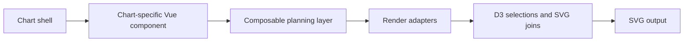

# Architecture Overview

The main lesson in this repo is simple: Vue owns composition and reactivity, while D3 is kept inside small, focused adapters. The chart pages assemble a shell, a planning composable, and a set of render components.

Code examples:

- [Chart.vue](../src/components/common-ts/Chart.vue#L1-L38) only sets the SVG view box, margin transform, and a slot.
- [LineChart.vue](../src/components/LineChart/LineChart.vue#L1-L105) parses input, builds chart props, calls `useLineChart`, and renders axis, tooltip, gradient, line, and Voronoi layers.
- [Sankey.vue](../src/components/Sankey/Sankey.vue#L1-L115) wires `useNodesAndLinks`, `useCollapsed`, `Links`, `Nodes`, `Labels`, and `Voronoi` together.

What to teach:

- Keep the shell thin.
- Keep chart math in composables.
- Keep SVG mutation in render components.
- Make the top-level component an assembler, not a place where all logic accumulates.
