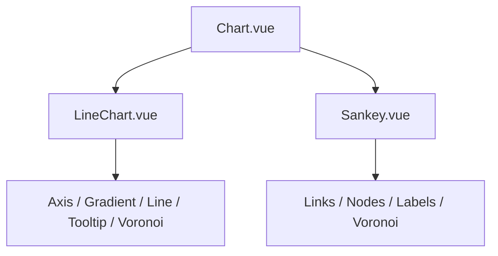

# Chart Shells

The shell components are small on purpose. They give every chart a stable frame and let the chart-specific component decide what to place inside that frame.

Facts from the code:

- [Chart.vue](../src/components/common-ts/Chart.vue#L1-L38) computes `viewBox` and `translate(...)`, then renders a slot inside an SVG `<g>`.
- [LineChart.vue](../src/components/LineChart/LineChart.vue#L53-L104) passes computed props into `useLineChart`, then places `Tooltip`, `Axis`, `Gradient`, `Line`, and `Voronoi` inside `Chart`.
- [Sankey.vue](../src/components/Sankey/Sankey.vue#L46-L115) passes `nodes` and `links` from composables into `Links`, `Nodes`, `Labels`, and `Voronoi`.

Why this scales:

- The same shell works for different charts.
- The child layers can change without rewriting the SVG frame.
- Shared spacing and sizing stay in one place.
