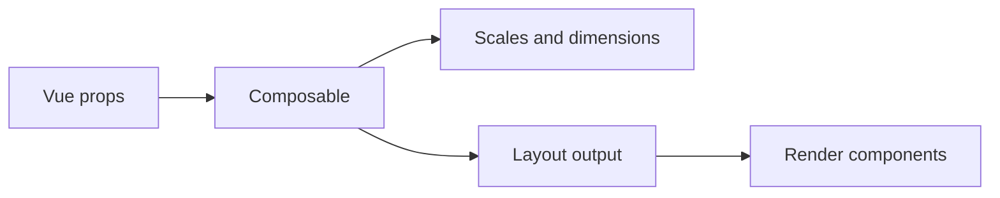

# Composable Planning Layers

This repo uses composables as the place where chart math happens.

Facts from the code:

- [useLineChart.ts](../src/composables/useLineChart.ts#L22-L60) computes inner size, x and y scales, a line generator, and the final `pathD` string.
- [useNodesAndLinks.ts](../src/composables/useNodesAndLinks.ts#L24-L74) computes Sankey dimensions, builds a configured D3 Sankey generator, normalizes input links, and returns reactive nodes and links.
- [LineChart.vue](../src/components/LineChart/LineChart.vue#L53-L77) and [Sankey.vue](../src/components/Sankey/Sankey.vue#L46-L65) both build computed props and hand them to the composables instead of mixing layout math into the template.

What to teach:

- Use composables for data-to-geometry work.
- Return computed values, not DOM nodes.
- Keep the composable API explicit so the chart component can stay thin.
