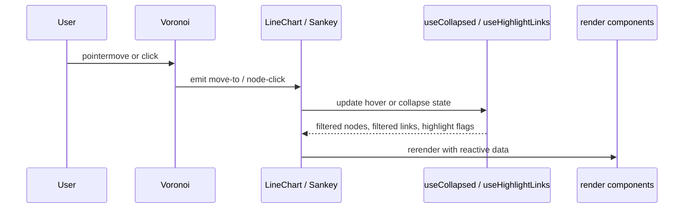

# Interaction State

The interaction code keeps hover and collapse logic separate from layout logic.

Facts from the code:

- [Voronoi.vue](../src/components/common-ts/Voronoi.vue#L12-L129) builds a Delaunay/Voronoi hit area from projected points, emits `move-to` on pointer move, and emits `node-click` on click.
- [useHighlightLinks.ts](../src/composables/useHighlightLinks.ts#L14-L98) tracks upstream and downstream node sets and decides whether a link should be highlighted.
- [useCollapsed.ts](../src/composables/useCollapsed.ts#L20-L214) owns `collapsedNodes`, `filteredNodes`, and `filteredLinks`.
- [Sankey.vue](../src/components/Sankey/Sankey.vue#L49-L86) stores hover state in `labelDatum` and `labelId`, and clears them on unmount.
- [LineChart.vue](../src/components/LineChart/LineChart.vue#L80-L103) and [Sankey.vue](../src/components/Sankey/Sankey.vue#L104-L113) both use `Voronoi` as the pointer layer.

What to teach:

- Keep pointer math in one place.
- Keep hover state separate from collapse state.
- Derive visible nodes and links from state instead of mutating the raw dataset.
