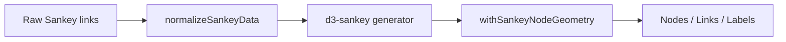

# Sankey Data Boundaries

The Sankey code shows a clear boundary between raw link data, normalized layout data, and rendered geometry.

Facts from the code:

- [sankeyModel.ts](../src/composables/sankeyModel.ts#L6-L116) defines the Sankey node and link types, creates a node map from raw links, and turns D3 geometry back into render-friendly `x`, `y`, `width`, and `height` values.
- [useNodesAndLinks.ts](../src/composables/useNodesAndLinks.ts#L38-L66) configures the Sankey generator with `nodeAlign`, `nodeId`, `nodePadding`, `nodeWidth`, and `extent`, then applies `withSankeyNodeGeometry`.
- [Sankey.vue](../src/components/Sankey/Sankey.vue#L46-L65) consumes the result without redoing the normalization work.

Why this matters:

- Render components do not need to know how raw links become nodes.
- The boundary makes geometry easier to test.
- If the input shape changes, the change stays close to the normalization layer.
