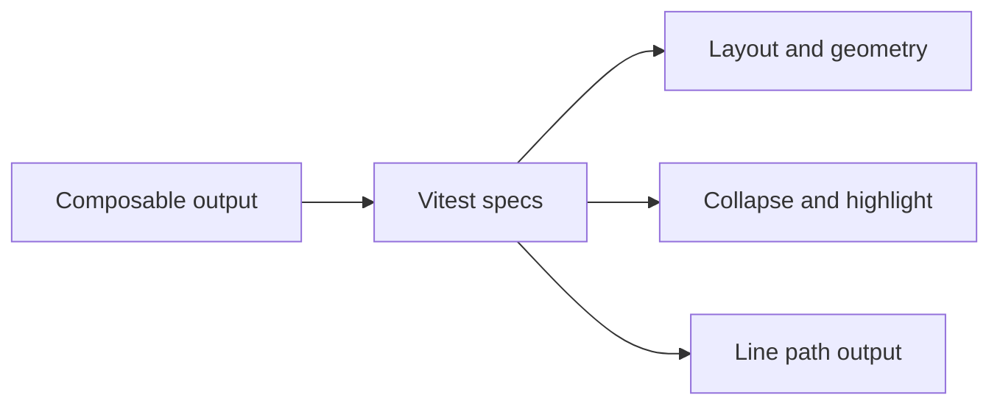

# Testing Contracts

The tests show what the repo considers stable: composable output, collapse behavior, highlight behavior, and key geometry values.

Facts from the code:

- [useLineChart.spec.ts](../src/composables/__tests__/useLineChart.spec.ts#L5-L75) checks inner dimensions, scale ranges, and path output.
- [useNodesAndLinks.spec.ts](../src/composables/__tests__/useNodesAndLinks.spec.ts#L31-L166) checks computed chart size, node/link structure, and the current Sankey geometry baseline.
- [useCollapsed.spec.ts](../src/composables/__tests__/useCollapsed.spec.ts#L1-L368) checks collapse and expand behavior, including multi-parent cases.
- [useHighlightLinks.spec.ts](../src/composables/__tests__/useHighlightLinks.spec.ts#L6-L132) checks direct connections, propagation, and collapsed-node behavior.

What to teach:

- Test the chart logic where it lives.
- Lock down geometry and state transitions, not just rendered markup.
- Keep the test names close to the behavior they protect.
